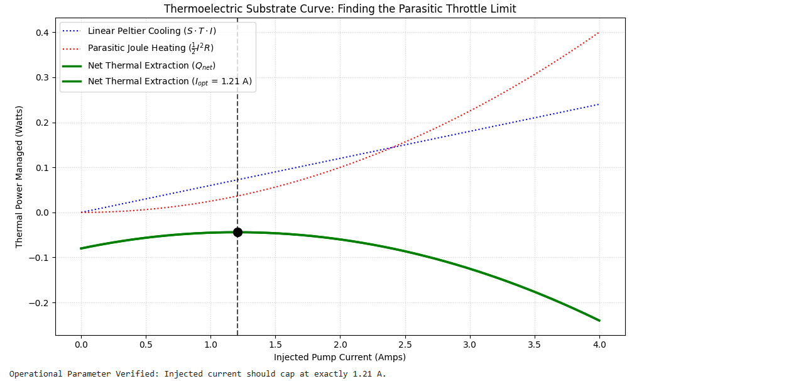
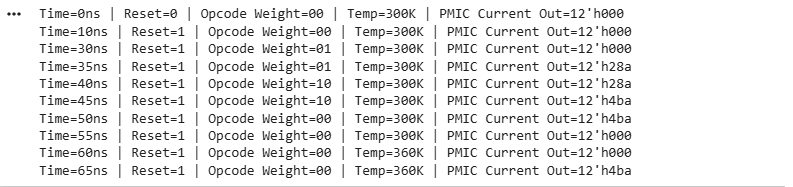

# Co-Designed Active Phonon-Drag Forwarding Package Matrix

An advanced heterogeneous semiconductor packaging architecture that bridges software workload awareness with solid-state thermodynamics to bypass thermal barriers in high-performance computing (HPC) nodes.

## 🚀 Core Features
* **Predictive Thermal Management:** Intercepts high-weight instructions (AVX-512, Tensor matrix loops) at the Decode pipeline stage to activate cooling before the physical heat wave propagates.
* **Heterogeneous Substrate Allocation:** Places active p-type thermal pillars under high-density logic zones while utilizing high-strength, low-cost SiC and AlN for passive structural balancing.
* **Parasitic Protection Throttling:** Hardware-capped optimal injection current ($I_{opt} = 1.21$ A) to maximize solid-state Peltier extraction efficiency before quadratic Joule heating ($\frac{1}{2}I^2R$) induces thermal burnout.
* **Laminar Micro-Channels:** A copper micro-channel liquid cold plate interface designed to maintain cooling fluid flow strictly within a steady, predictable laminar flow regime ($Re \ll 2000$).

## 📁 Project Structure
* `simulation/thermoelectric_optimization.py` - 1D Implicit solver & parabolic current optimization
* `rtl/thermal_lookahead_unit.v` - Verilog RTL core and validation testbench

## 🛠️ Verification & Testing
The digital control logic was successfully verified using Icarus Verilog (`iverilog`), mapping look-ahead cycle changes directly to instruction window steps:
* **Scenario A (Idle):** Target current registers at `12'h000` (0 A) to prevent baseline parasitic heat.
* **Scenario B (Vector Load):** Proactively ramps current to `12'h28a` (~0.65 A) within a single clock cycle.
* **Scenario C (Tensor Load):** Locks at peak optimization ceiling `12'h4ba` (1.21 A).
* **Scenario D (Thermal Emergency):** Telemetry override forces immediate max cooling upon detecting an external junction temperature breach (>350 K).

## 📜 License
This project is licensed under the MIT License.

## 🛠️ Verification & Testing
The digital control logic and thermodynamic constraints have been fully modeled and verified.

### 1. Substrate Current Optimization Curve
The 1D implicit solver maps out the precise inflection point where linear Peltier cooling gives way to quadratic parasitic Joule heating, identifying the absolute performance ceiling at $1.21\text{ A}$.

### 2. RTL Pipeline Look-Ahead Trace
The digital control logic was successfully verified using Icarus Verilog (`iverilog`), demonstrating single-cycle proactive scaling and a robust thermal emergency override gate.

